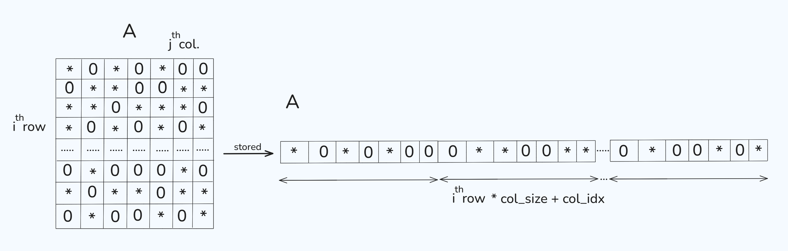

# rv-sparse: Open-source RISC-V Vector accelerated sparse linear algebra library
## Code Challenge for Mentorship

The task required implementing a function that takes a dense matrix A and efficiently computes its product with a vector x. The function first scans the matrix to identify non-zero elements, organizes them into CSR (Compressed Sparse Row) format using preallocated buffers provided by the caller then uses that compact representation to compute the result. An important requirement was that the function performs no memory allocation of its own, all necessary buffers are set up by the caller AOT (ahead of time).

The function receives matrix A already laid out in row-major order in memory meaning all elements of row 0 come first, followed by row 1, and then so on. Rather than working with this dense representation directly, the function compresses it by scanning each row and extracting only the elements that exceed the __sparsity threshold__ [1]. For each non-zero found, its value is stored in the `values` buffer and its column index in `col_indices`, both advancing together through a single counter `non_zero_row_idx`. Before processing each row, the current value of this counter is recorded in `row_ptrs[i]`, so that later, the interval `[row_ptrs[i], row_ptrs[i+1])` unambiguously identifies which entries in values belong to that row. A final sentinel value written at `row_ptrs[rows]` closes the last interval.

I implement Kahan optimization for numerical stabiliity. In mathematics, `(a + b) + c = a + (b + c)` is always true on any (abelian) group, ring, field etc. A double has 52 bits of mantissa. When I add two numbers of very different magnitudes the smaller one must be aligned with the exponent of the larger one and in the process it loses bits on the right. To be more clear, `1.0 + 1e-16 == 1.0` is true
in IEEE754 standard. So instead of throwing away the rounding error I capture it and add it back to the next step. For more details: 
[Kahan Summation](https://en.wikipedia.org/wiki/Kahan_summation_algorithm)

[1]: __sparsity threshold__ : instead of checking `elem == 0.0` exactly which is unsafe under IEEE 754 (floating point arithmetic can produce values like `1e-17` from cancellation that are numerically zero but not exactly representable as zero), the function uses a tolerance of `DBL_EPSILON * 1024`. `DBL_EPSILON` (~2.22e-16) is the smallest value such that `1.0 + DBL_EPSILON != 1.0` in double precision, it represents the granularity of the format. The multiplier 1024 (10th power of 2) accounts for accumulated rounding over a realistic number of intermediate operations resuilting in a threshold of ~2.27e-13. Any element under this is treated as structurally zero. A more rigorous alternative would scale the threshold relative to the Frobenius norm of the test matrix. This norm which measures the overall magnitude of the matrix. This makes the tolerance proportional to the scale of the problem rather than an absolute constant.
For the values in this harness (uniformly from [-10, 10]) the chosen value is sufficient.

The prefetch distance of 4 in `__builtin_prefetch(&x[col_indices[k+4]])` is also derived from the same principle: L2 cache latency on modern hardware is roughly 12 cycles, and the loop body executes in approximately 3 cycles, so prefetching 4 iterations ahead
hides memory latency of irregular gather on `x`. The value is of course dependent on architecture and exposed as a tunable constant in a production-like set.

The second argument 0 in `if (__builtin_expect(fabs(elem) > SPARSITY_TOL, 0))` condition tells the compiler that the branch is sparse (the matrix is ​​sparse so the leading elements are zero). The branch predictor is prepared correctly in this way.

---
### Run
`make` (in the task description the -lm flag for linker is placed wrong)

For larger or more specific inputs additional optimizations are applicable (eg. SIMD/AVX vectorization, Cuthill-McKee reordering etc.)I think these are beyond the scope of this implementation given the matrix dimensions involved.
